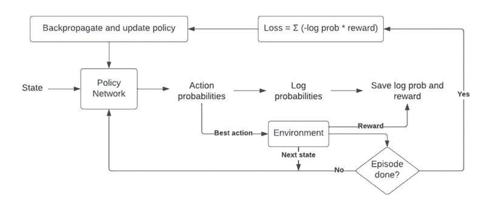

# Week 04: Applying the REINFORCE Algorithm

## Lab session

Welcome to the fourth week of our Reinforcement Learning course! In this lab session, we will build upon delve the second week's lab, which focused on the CartPole problem with Q-Learning. Today, we'll implement a different approach with the REINFORCE algorithm, a policy-based reinforcement learning method.

## Educational Objectives

- Understand the fundamentals of the REINFORCE algorithm and how it differs from action-value-based methods like Q-Learning.
- Be able to implement policy-based reinforcement learning using the REINFORCE algorithm.
- Be able to apply the REINFORCE algorithm to solve the CartPole problem.

## Getting Started

Please group up in pairs and open the notebook from week 02 in either Google Colab or on your local machine. To refresh your memory, here is a flowchart of how REINFORCE works:

## Tasks

This graded lab is designed for you to prove your understanding of the REINFORCE algorithm.

- Implement REINFORCE: Start by implementing the REINFORCE algorithm in the provided code. Understand how it updates the policy to maximize expected rewards.
- Hyperparameter tuning: Experiment with different hyperparameters like the learning rate to get a feel how that influences the training.
- Compare with Q-Learning: Reflect on the differences between Q-Learning and REINFORCE. How does the policy-based approach of REINFORCE compare to the value-based approach of Q-Learning in solving the CartPole problem?
- Extension: If you're feeling ambitious, consider trying the REINFORCE algorithm on another RL problem (like the GridWorld environment) to gain more practical experience.

## Key Takeaways

- Policy-Based Reinforcement Learning: REINFORCE is a policy-based reinforcement learning algorithm that directly learns the policy to maximize expected rewards.
- Comparative Analysis: Understand the differences between policy-based and value-based methods like Q-Learning.
- Hyperparameter Tuning: Experimenting with the hyperparameters helps develop a feel for the algorithm.
