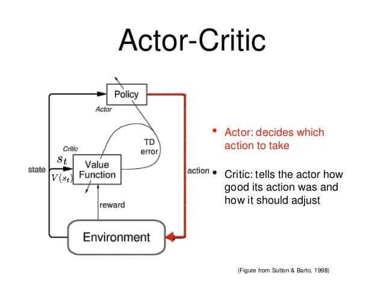

# Week 06: Actor-Critic (A2C), Annealing, and Upper Confidence Bound

## Lab session

Welcome to the sixth week of our Reinforcement Learning course! In this lab session, we will try our hands on actor-critic reinforcement learning - hence drawing upon last week's lecture - and also extending our understanding for exploration vs exploitation. Today, you will work on two notebooks. The first one is the cartpole notebook that you already know, and the second one will help you grasp annealing and UCB.

## Educational Objectives

- Understand the actor-critic (A2C) algorithm.
- Be able to implement A2C in a practical example.
- Understand how to use exploration strategies with annealing.
- Understand how to use exploration strategies with UCB.

## Getting Started

Please group up in pairs and open the notebook from week 04 in either Google Colab or on your local machine. This is the notebook where you implemented the REINFORCE algorithm for the cartpole environment, replacing Q-Learning. To refresh your memory, here is a flowchart of how A2C works:

For the second task, download the notebook from the teams channel that corresponds to this week's lab.

## Tasks

This lab offers the opportunity to experiment with A2C and explore different exploration strategies.

- A2C for CartPole: Implement the A2C algorithm to solve the CartPole problem. Observe how the agent learns to balance the pole. How does it compare to your REINFORCE-only implementation?
- Exploration vs. Exploitation: Read and work through the second notebook ('Lab_06_Annealing_and_UCB.ipynb') and understand how those algorithms work. Experiment with different values of the epsilon parameter. This task does not require you to implement anything.

## Key Takeaways

- Actor-Critic (A2C): A2C is a powerful reinforcement learning algorithm that combines aspects of both value-based and policy-based methods.
- Annealing Exploration: Annealing exploration rates over time can help agents explore aggressively in the beginning and then focus on exploiting their knowledge as they learn. We have seen this in the introductory notebook already.
- Upper Confidence Bound (UCB): UCB is a well-known strategy for making decisions under uncertainty, often used in multi-armed bandit problems.
- Real-World Relevance: Understanding how exploration strategies impact RL algorithms is essential for applying reinforcement learning to real-world problems, where exploration can be costly.
